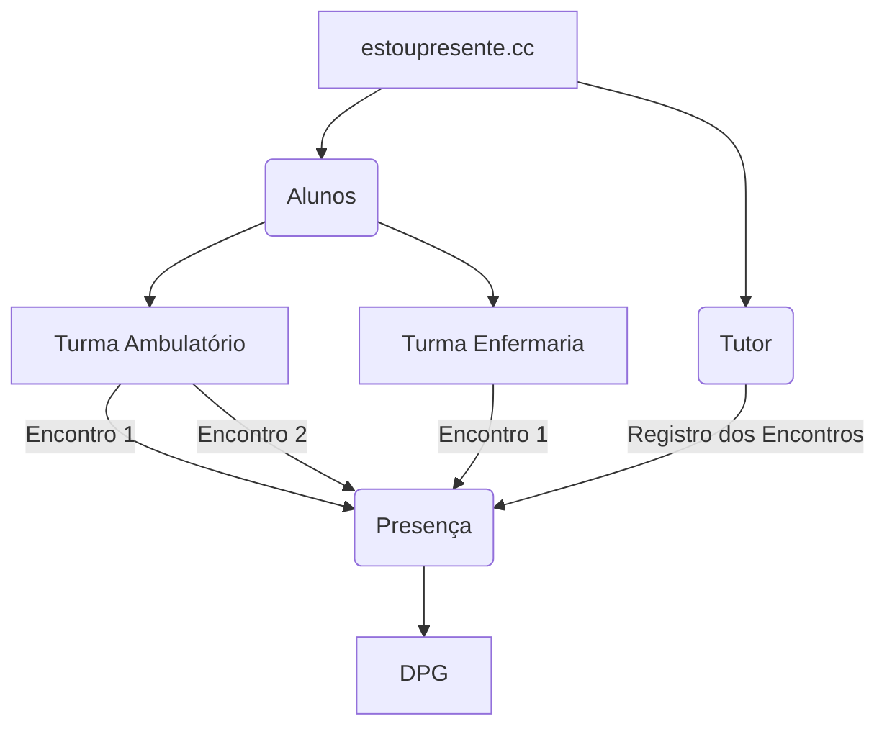

Este site foi criado para orientar os Professores e Alunos a usar o site [estoupresente.cc](https://estoupresente.cc) para registro das presenças online.

O aplicativo está sendo incialmente desenvolvido para tentar solucionar o problema do registro de presenças dos alunos do curso de medicina da Universidade Federal da Paraíba durante o estágio obrigatório do internato. 

Nos últimos dois anos do curso de medicina o aluno cumpre carga horária obrigatória de estágio supervisionados em serviço. Neste período, os alunos são distribuídos em centenas de atividades dentro e fora do [Hospital Universitário Lauro Wanderley](https://www.gov.br/ebserh/pt-br/hospitais-universitarios/regiao-nordeste/hulw-ufpb).

Para registrar essas atividades é necessário um instrumento fácil de utilizar, que possa ser levado de um lugar a outro, que seja seguro e acessível por vários usuários ao mesmo tempo. 

Pensando nisso foi desenvolvido o [estoupresente.cc](https://estoupresente.cc), com este aplicativo é possível registrar as presenças de forma segura e online. O registro fica disponível instantaneamente para o aluno, o tutor e para o setor administrativo do departamento responsável pela verificação e consolidação dos registros no SIGAA. 

O aplicativo é organizado com 3 tipos de usuários:

**Administradores**

Os administradores, de forma compartilhada com os tutores, criam turmas e convidam alunos. Cada turma possui um calendário próprio de encontros que são adicionados de acordo com o cronograma do rodízio. Os alunos que estiverem cadastrado na turma estão aptos a receberem as presenças dos encontros cadastrados no cronograma. Os administradores também possuem acesso em tempo real as presenças registradas no sistema.  

**Tutores**

Responsável pelo registro das atividades em campo através da leitura de qrcodes individuais dos alunos. 

Acessando as páginas das turmas é possível selecionar um encontro previamente cadastrado para aquela turma e fazer o registro das presenças dos alunos.

**Alunos**

Após o registro na plataforma será capaz de emitir um qrcode no seu perfil e poder apresentar ao tutor para o registro das presenças _online_ durante sua atividade prática.

