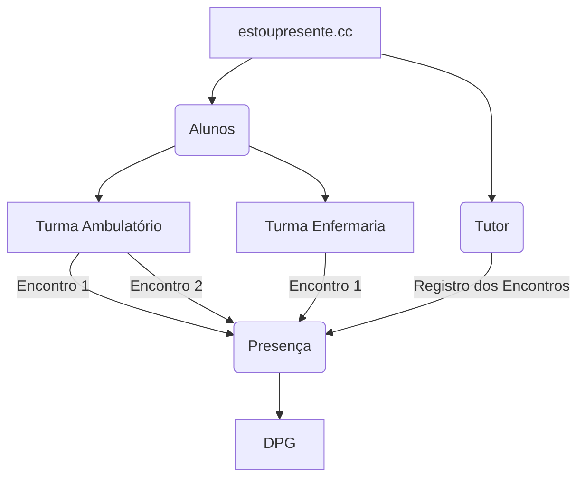

Este site foi criado para orientar os Professores e Alunos a usar o site [estoupresente.cc](https://estoupresente.cc) para registro das presenças online.

O aplicativo está sendo incialmente desenvolvido para tentar solucionar o problema do registro de presenças dos alunos do curso de medicina da Universidade Federal da Paraíba durante o estágio obrigatório do internato. 

Nos últimos dois anos do curso de medicina o aluno cumpre carga horária obrigatória de estágio supervisionados em serviço. Os alunos são distribuídos em centenas de atividades dentro e fora do [Hospital Universitário Lauro Wanderley](https://www.gov.br/ebserh/pt-br/hospitais-universitarios/regiao-nordeste/hulw-ufpb) ao longo do período de internato.

Para registrar as atividades nesse período é necessário um instrumento que esteja disponível em toda a região geográfica da cidade e que possa ser levado com facilidade de um lugar para outro. 

Pensando nisso foi desenvolvido o aplicativo [estoupresente.cc](https://estoupresente.cc), com este aplicativo é possível registrar as presenças de forma segura e online. O registro fica disponível instantaneamente para o aluno, o tutor e para o setor administrativo do departamento responsável pela verificação e consolidação dos registros no SIGAA. 

